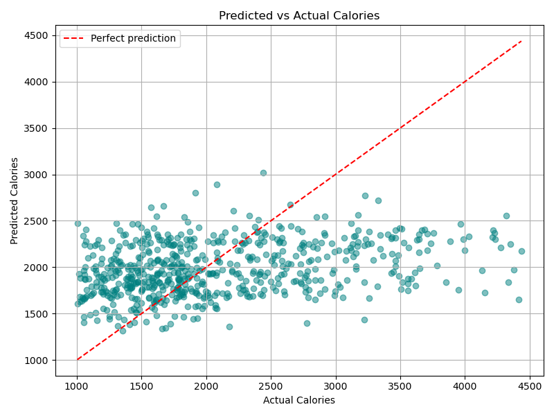
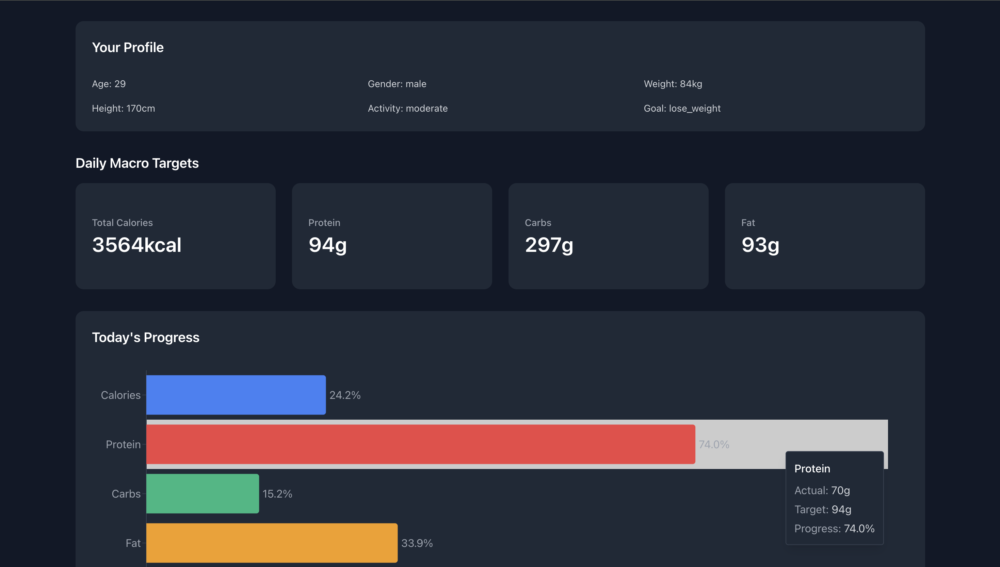
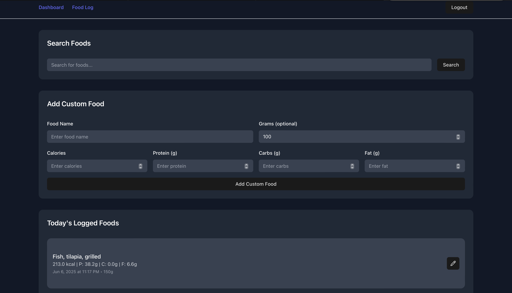

# SmartFit – AI-Powered Fitness Tracker 💪🧠

**SmartFit** is a full-stack fitness tracker that helps users log meals, monitor progress, and receive personalized daily macro recommendations. Built with **React**, **FastAPI**, and a trained **machine learning model**, SmartFit offers tailored nutrition goals based on each user's age, gender, height, weight, and activity level.

---

## 🔍 Features

* 🔐 Secure user authentication (register/login) using JWT (JSON Web Tokens)
* 🍽️ Food logging with calorie and macronutrient breakdowns
* 🤖 AI-powered macro recommendation engine (ML model)
* 📊 Dashboard with real-time progress vs. daily targets
* 🔎 Food search via USDA FoodData Central API
* 🧼 Clean, responsive UI with Tailwind CSS and React Context
* ⚙️ FastAPI backend with SQLite and SQLAlchemy

---

## ⚙️ Tech Stack

**Frontend**:

* React (TypeScript)
* Tailwind CSS
* Vite

**Backend**:

* FastAPI
* SQLite + SQLAlchemy
* JWT-based authentication with OAuth2
* Pydantic

**Machine Learning**:

* Python (Pandas, scikit-learn, joblib)
* `MultiOutputRegressor` with `RandomForestRegressor` and `HistGradientBoostingRegressor`
* Trained on real dietary data from the **NHANES** dataset

---

## 🧠 Machine Learning Overview

SmartFit integrates a complete ML pipeline into the product experience:

* 🔄 Cleaned and preprocessed NHANES `.XPT` files (dietary survey data)
* 📉 Removed calorie outliers (1000–4500 kcal/day) to reduce noise
* 🧪 Performed model selection, cross-validation, and hyperparameter tuning
* 🔁 Experimented with log-transformation and activity level features
* ✅ Final model: RandomForestRegressor using 4 input features (age, gender, weight, height)
* 📊 R² ≈ 0.07 on test set (modest due to real-world variability)


Predicted vs Actual Calories – Final Model



Although performance is limited by noisy input data, the project demonstrates **end-to-end ML deployment**, from preprocessing to API integration and real-time use in a full-stack app.

---

## 🚀 Getting Started

### 1. Clone the repository

```bash
git clone https://github.com/ccamposlozano/fitness-tracker-ai.git
cd fitness-tracker-ai
```

### 2. Setup the backend

```bash
cd backend
python -m venv venv
source venv/bin/activate  # On Windows: venv\Scripts\activate
pip install -r requirements.txt
uvicorn app.main:app --reload
```

### 3. Setup the frontend

```bash
cd frontend
npm install
npm run dev
```

### 4. Set API base URL for frontend

In `frontend/src/api/index.ts`, configure your backend API URL:

```ts
const API_URL = 'https://smartfit-backend.onrender.com';
```

Update this to match your deployed or local backend as needed.

---

## 🌐 Live Demo

🔗 [Try the App](https://fitness-tracker-ai-gamma.vercel.app/)
*(Hosted on Vercel)*

⚠️ **Note:** The backend runs on Render’s free tier and may take **20–60 seconds** to wake up after inactivity.  
Please be patient if the app takes a moment to load

---

## 🖼️ Preview

### Dashboard



### Food Logging



---

## 📁 Project Structure

<pre>  
SmartFit/
├── backend/
│ ├── app/
│ │ ├── data/ # NHANES dataset and cleaning scripts
│ │ ├── model/ # Trained ML model (.pkl)
│ │ ├── models/ # SQLAlchemy database models
│ │ ├── routes/ # API endpoints
│ │ ├── schemas/ # Pydantic models
│ │ ├── services/ # Macro calculations and logic
│ │ ├── utils/ # Helper utilities
│ │ ├── database.py # SQLAlchemy engine and session
│ │ └── main.py # FastAPI entry point
│ └── requirements.txt
│
├── frontend/
│ ├── src/
│ │ ├── api/ # API functions (frontend-backend connection)
│ │ ├── components/ # UI components
│ │ ├── context/ # Global auth and app context
│ │ ├── lib/ # Utility logic (e.g. helpers, constants)
│ │ ├── pages/ # Dashboard, Food Log, Auth pages
│ │ ├── types/ # TypeScript interfaces and types
│ │ ├── App.css
│ │ ├── index.css
│ │ └── main.tsx
│ └── tailwind.config.js
│
├── scripts/ # ML preprocessing and analysis
│ ├── clean_nhanes.py
│ ├── visualize_predictions.py
│ └── outputs/ # Prediction visualizations
│
├── README.md
├── CHANGELOG.md
└── structure.txt
</pre>

---

## 📈 Future Improvements

* 📸 Image-based food recognition for automatic logging
* ⚖️ Improve ML model with additional features (e.g., meal timing, past logs)
* 🧠 Add AI chatbot for coaching or diet suggestions
* 📱 Fully responsive mobile experience
* 📉 Add weight tracking and macro history charts
* 👤 Demo user with pre-populated logs for quick preview

---

## 🎯 Why I Built This

This solo project was created to sharpen my skills in:

* Full-stack web development (React + FastAPI)
* Machine learning model deployment in production
* REST API design and data engineering
* UI/UX and product thinking from idea to deployment

It combines my passion for fitness and AI to deliver a real-world solution that helps users stay on track with their goals.

---

## 📬 Feedback

If you have ideas, suggestions, or just want to connect — feel free to reach out or open an issue. I'm always open to feedback and collaboration!

---

## 📜 License

MIT License – use it, fork it, build on it!
